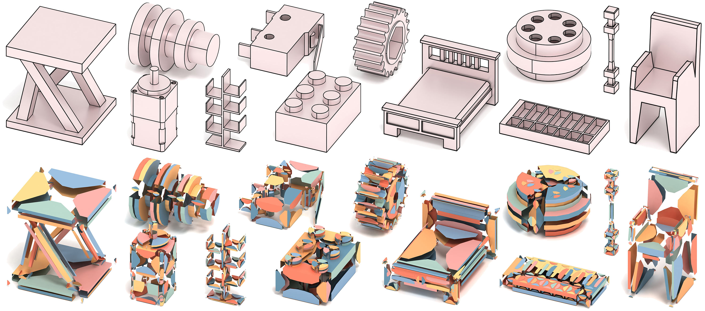

# BrepGPT: Autoregressive B-rep Generation with Voronoi Half-Patch  [](https://arxiv.org/abs/2511.22171)


---

This repository provides the official code of BrepGPT, accepted to SIGGRAPH Asia 2025 (Journal Track).

---

B-rep is the standard CAD representation, but its irregular graph structure — where geometry and topology are tightly coupled at multiple levels — makes it difficult to handle with deep learning.

Beyond the generative network, one contribution of this work is the **Voronoi Half-Patch (VHP)** representation. VHP decomposes a B-rep into local units defined on half-edges, each encoding geometry and topology in a fixed-dimensional format. This converts a B-rep — an irregular graph — into a set of uniform tokens directly consumable by deep learning, supporting both edge-level and vertex-level latent representations. BrepGPT demonstrates this with an autoregressive Transformer, but VHP is framework-agnostic: its uniform structure is equally compatible with diffusion models or other generative approaches.

## Environment Setup

```bash
mamba create -n brepgpt python=3.9 -y
conda activate brepgpt

mamba install occwl -c lambouj -c conda-forge -y
conda install pytorch pytorch-cuda=12.1 -c pytorch -c nvidia -y
pip install  dgl -f https://data.dgl.ai/wheels/torch-2.1/cu121/repo.html
```


## Usage

We provides a VHP (Voronoi Half-Patch) data processing pipeline for BrepGPT, consisting of two stages:

```
STEP files  ──brep2VHP──►  VHP graphs (.bin)  ──VHP2brep──►  STEP files
              (training data preparation)          (reconstruction)
```

### Stage 1: brep2VHP

Convert your own B-rep models (STEP format) into VHP graph data for training. Edit the `ROOT` path in the script, then run:

```bash
cd VHP/brep2VHP
bash brep2VHP.sh
```

The script runs four steps in sequence: scale and split closed faces/edges → handle inner wires → resolve duplicate edges → sample VHP graphs. The output `.bin` files are DGL graphs.

### Stage 2: VHP2brep

Reconstruct B-rep STEP models from VHP graphs. Edit the `ROOT` path in the script, then run:

```bash
cd VHP/VHP2brep
bash VHP2brep.sh
```

Two surface fitting strategies are available (toggle via `--use-uv` in the script):

**Standard mode** (default, as described in the paper): builds faces using `BRepFill_Filling` with Voronoi interior point constraints. No UV data required. Works well for models dominated by planar and simple curved surfaces.

**UV mode** (`--use-uv`): fits a B-spline surface via `GeomAPI_PointsToBSplineSurface` using RBF-interpolated UV→XYZ mappings. More robust for complex freeform surfaces.

| | Standard mode | UV mode |
|---|---|---|
| Surface method | `BRepFill_Filling` | `GeomAPI_PointsToBSplineSurface` |
| UV data needed | No | Yes |
| Best for | Planar / simple curved surfaces | Complex freeform surfaces |

## Release Progress

- [x] VHP data processing code
- [ ] Model training and inference code


## Citation

If you use this code in your research, please cite:

```bibtex
@article{li2025brepgpt,
  title     = {BrepGPT: Autoregressive B-rep Generation with Voronoi Half-Patch},
  author    = {Li, Pu and Zhang, Wenhao and Quan, Weize and Zhang, Biao and Wonka, Peter and Yan, Dong-Ming},
  journal   = {ACM Transactions on Graphics},
  volume    = {44},
  number    = {6},
  pages     = {226:1--226:18},
  year      = {2025},
  publisher = {ACM}
}
```
